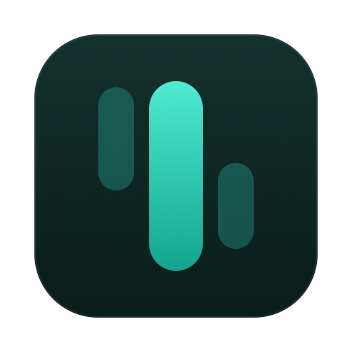
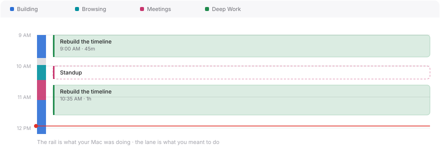

<div align="center">



# Span

**Where did the day actually go?**

A macOS time tracker that records the sessions you start, the blocks you write
down, and what your Mac was doing in between — then asks how much of it was
genuinely work.

[](../../releases/latest)


</div>

<br>

<div align="center">
<picture>
  <source media="(prefers-color-scheme: dark)" srcset="docs/timeline-dark.svg">
  
</picture>
</div>

<br>

---

## Install

> **Download the DMG → [latest release](../../releases/latest)**

```sh
# 1 · Drag Span into Applications from the DMG, then:
xattr -dr com.apple.quarantine /Applications/Span.app
```

<details>
<summary><b>Why that command is necessary</b></summary>

<br>

Span is not signed with an Apple Developer ID, so macOS quarantines it on
download and refuses to open it — usually with *"Span is damaged and can't be
opened."*

The app is not damaged. That is simply what macOS says about an unsigned app
that arrived from the internet. The command removes the quarantine flag the
download added.

Right-clicking and choosing **Open** is *not* enough for an ad-hoc-signed app on
recent macOS. The Terminal command is the reliable route.

The honest fix is a paid Apple Developer account, a Developer ID signature and
notarization. Until then, this is the cost of installing it.

</details>

**Requires macOS 14 (Sonoma) or later · Apple Silicon**

---

## What it does

<table>
<tr>
<td width="50%" valign="top">

### ⏱ Focus sessions

Name it, pick a category, pick a length — 30 minutes, an hour, 90 minutes, two
hours, or anything you type.

Pausing stops the clock, and that matters: a 60-minute session paused for 15
counts as **45 minutes of focus**, not 60. Those stretches are what the timeline
draws, which is why a session you broke off appears as two blocks with a gap.

</td>
<td width="50%" valign="top">

### ◎ The honest review

Afterwards, rate your focus and say how much of the time was *genuinely* work.
Skipping is recorded as skipping, not as a zero.

The day and week then show two separate numbers — time on the clock, and time
that felt real. **The gap between them is the point.** A timer alone will
happily tell you that you worked eight hours.

</td>
</tr>
<tr>
<td width="50%" valign="top">

### ▤ A day timeline

Two tracks. A narrow **rail** shows what your Mac was doing, as one continuous
band coloured by category. A wide **lane** holds your sessions and the blocks
you add by hand.

Drag empty space to sweep out a block — it snaps to five minutes and opens for
naming. Drag a block to move it, or its edges to change when it started or
ended. Running sessions included.

</td>
<td width="50%" valign="top">

### ◍ Categories that are yours

A category is a name with a colour. Seven come set up; add your own.

Ten preset colours are chosen to stay apart from one another — including for
the most common kinds of colour blindness — with a colour wheel when none of
them suit. You decide which app belongs where, and changing it **re-files time
already recorded**, not just what comes next.

</td>
</tr>
</table>

### ⦿ Automatic tracking, and what it cannot see

Every few seconds Span asks macOS two things: **which app is in front**, and
**how long since you last touched the keyboard**. That is the whole mechanism.

| | |
|---|---|
| Records | A span per app — *"Safari, 9:12 to 9:34"* |
| Records | Breaks, back-dated to when input actually stopped |
| **Cannot see** | **What you type.** Knowing *when* input happened is not seeing *what* it was |
| **Cannot see** | **Your screen.** No capture, no screenshots, no reading of content |

Short switches are absorbed, so alt-tabbing does not litter the day. Sleeping or
locking the Mac is recorded as away, so waking hours later does not read as an
all-night stretch in whatever was open. Background daemons are ignored.

Granting **Accessibility** adds one thing: the focused window's title, which is
where a browser's page title comes from. Without it you still get every app and
every break. Tracking never blocks on it.

### ▦ Elsewhere

**Insights** — a 14-day trend against your target, on-the-clock against time
that felt real, and where the hours went · **Menu bar** — the running session's
remaining time, with start, pause and finish · **Floating HUD** — a capsule
below the menu bar showing time since your last break and progress toward your
target, which never steals focus from the app you are working in · **Guide** —
an in-app explanation of all of it, opened on first run

---

## Keyboard

<div align="center">

| Shortcut | |
|:---:|---|
| <kbd>⌘</kbd><kbd>N</kbd> | Start a session |
| <kbd>⌘</kbd><kbd>B</kbd> | Add a time block at the current time |
| <kbd>⌘</kbd><kbd>T</kbd> | Jump to today |
| <kbd>⌘</kbd><kbd>[</kbd> · <kbd>⌘</kbd><kbd>]</kbd> | Previous / next day |
| <kbd>⌘</kbd><kbd>,</kbd> | Settings |

</div>

---

## Your data

One file, on your Mac:

```
~/Library/Application Support/Span/Span.store
```

Nothing you record is ever uploaded. **Settings → Your data** can delete the
tracked activity on its own, or reset Span entirely — every session, block,
category and preference — and start the setup questions again. Both ask you to
type a confirmation phrase first, because neither can be undone.

The one thing Span sends anywhere is a **daily check against the GitHub releases
API** to see whether a newer version exists. It transmits nothing but the
request, and **Settings → Updates** turns it off.

When an update is available, Span installs it itself — download, swap, relaunch,
from **Settings → Updates**. You only need the DMG and the `xattr` command for
the very first install. Note that Span verifies the download over HTTPS from
GitHub but performs no signature check, because it has no Developer ID to sign
with.

Because window-title capture needs Accessibility, Span is deliberately **not
sandboxed**, and so cannot ship on the Mac App Store.

---

## Build from source

<details>
<summary><b>Requires Xcode 16 or later</b></summary>

<br>

```sh
git clone https://github.com/ameymalhotra/span.git
cd span

xcodebuild -project TimeManager.xcodeproj -scheme TimeManager \
  -destination 'platform=macOS,arch=arm64' -configuration Debug \
  -derivedDataPath /tmp/SpanBuild \
  build CODE_SIGN_IDENTITY="-" CODE_SIGNING_REQUIRED=YES

open /tmp/SpanBuild/Build/Products/Debug/Span.app
```

Sign the build rather than passing `CODE_SIGNING_ALLOWED=NO`: macOS keys the
Accessibility grant to the code signature, so an unsigned binary has to be
re-authorised on every rebuild. Use `CODE_SIGNING_ALLOWED=NO` only for a
compile-only check.

</details>

<details>
<summary><b>Tests — 284, about a second</b></summary>

<br>

```sh
xcodebuild test -project TimeManager.xcodeproj -scheme TimeManager \
  -destination 'platform=macOS,arch=arm64' -only-testing:SpanTests \
  -derivedDataPath /tmp/SpanBuild ONLY_ACTIVE_ARCH=YES \
  CODE_SIGN_IDENTITY="-" CODE_SIGNING_REQUIRED=YES
```

Tests never touch your real data — the scheme points the store at `/tmp` and
stubs out notifications. See [TESTING.md](TESTING.md).

</details>

<details>
<summary><b>Layout</b></summary>

<br>

```
TimeManager/
├── App/        Scenes, the shared model, the SwiftData stack
├── Models/     WorkSession · SessionSegment · ActivityRecord
│               TimeEntry · TimeCategory · AppCategoryRule
├── Tracking/   Frontmost-app tracking, idle detection, categorisation
├── Timeline/   Geometry, layout, blocks, the day view and its editors
├── Views/      Panes, shell, onboarding, shared controls
├── HUD/        The floating capsule
└── Design/     Theme, palette, formatters
```

</details>

---

## Known limitations

- **Not notarized** — hence the install command above
- **Apple Silicon** as built; no architecture-specific code, so a universal
  build is a change of destination
- **Ten category colours** — beyond ten, some share one. Every list shows the
  category name beside its colour for that reason
- **No screenshots in this README.** The diagram above is drawn from the app's
  own design tokens rather than captured, so it cannot go stale — but it is a
  diagram, not a photograph of the running app

---

## Roadmap

- [ ] A weekly review that makes the reflection data earn its keep
- [ ] Attributing idle time — saying what a break actually was
- [ ] Export to CSV and JSON
- [ ] Rules finer than the app name — a URL, not just "Safari"

---

<div align="center">
<sub>No licence is declared, so all rights are reserved by default.<br>
Add a <code>LICENSE</code> file to let others use or modify this.</sub>
</div>
